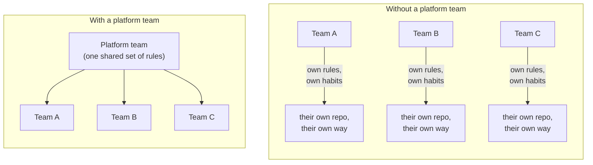

# Chapter 1 — Why platforms exist

## A scene, not a definition

Picture a small city's Department of Buildings and Planning. Every month,
new construction crews show up wanting to build something. Without that
department, here's what happens: each crew improvises. One crew wires the
electrical to code because their foreman happens to know the code. Another
doesn't, because their foreman doesn't. One crew keeps careful records of
who signed off on what; another crew's paperwork is a shoebox of receipts.
Six months later, when a wall needs repairing, nobody can even agree on
who's allowed to authorize the work.

Nothing in that story is anyone being careless on purpose. Every crew is
trying to build something good. The problem is structural: safety and
consistency were left up to whichever individual happened to remember to
care that day, and individual memory doesn't scale past a handful of
people.

A Department of Buildings and Planning fixes this by doing a small number
of specific things, once, centrally, rather than trusting each crew to
reinvent them correctly on their own:

1. **Issuing permits** — a real, tracked, numbered record that a specific
   project exists and belongs to someone.
2. **Enforcing a building code** — one fixed set of rules every permit is
   subject to, applied the same way no matter who's building or how
   experienced they are.
3. **Regulating utility hookups** — water, gas, and power don't get
   connected by a crew tapping the main themselves; they go through a
   permitted, auditable process.
4. **Requiring inspection before occupancy** — a building doesn't go
   straight from blueprint to people living in it. Someone checks the
   work first.

That's the whole shape of what a platform team does, translated directly:
issue repos instead of permits, enforce branch protection instead of a
building code, control how secrets and deployments happen instead of
utility hookups, and require review before something ships instead of an
occupancy inspection. Four repos, spread across the rest of this book,
each pick up one part of that job for real, with real code and real
commands you can run yourself.



## Platform team vs. stream-aligned team

Two words worth having precisely, because the rest of this book leans on
them constantly.

A **stream-aligned team** owns a slice of the actual business — checkout,
billing, search — and its customers are the company's real end users.

A **platform team** is different in one specific way: its customers are
*other engineering teams*, not end users. Its product is the paved road
every stream-aligned team drives on — repos, pipelines, secrets, clusters
— built so that no stream-aligned team has to become an expert in branch
protection policy or secrets rotation just to ship a feature.

This reframes something that could otherwise look like bureaucracy. A
platform team centralizing repo creation isn't control for its own sake,
any more than a buildings department is in the business of making
construction harder on purpose. It's the only way consistency and safety
survive contact with more than one team, because it moves the guarantee
from "a person remembers" to "a machine enforces."

<details>
<summary><strong>Predict before reading on:</strong> if a platform team's job isn't writing the product's actual application code, what do you think its day-to-day work actually looks like?</summary>

Mostly, it looks like maintaining a small number of configuration files
that describe what should exist, and reviewing pull requests against
those files — not writing product features, and not clicking through
buttons in a web console by hand. You're about to watch exactly that
happen, for real, in the next section: this book's own repository gets
created by editing one file and opening a pull request, not by anyone
clicking "New repository" on GitHub.
</details>

## Try it yourself — watching a platform team create a repo

Every repo in this project, including the one holding the words you're
reading right now, exists because of one file:
`platform-team-administration/config/platform_team_values.yaml`. Adding a
repo means adding a few lines to that file, nothing more.

Here's exactly what got added to create this book's own repo:

```yaml
- name: platform-guide
  description: >
    A beginner-to-intermediate guide to this platform, written as one
    continuous book — concepts, analogies, and hands-on practice woven
    together across all four repos.
  visibility: public
```

That change went through this project's normal process — a pull request,
reviewed and merged like any other change:

```console
$ gh pr create --title "feat: declare platform-guide repo" ...
https://github.com/phrankson/platform-team-admin/pull/13
$ gh pr merge 13 --merge --delete-branch
```

Then, back on the updated `main` branch, a program called Pulumi read the
file and compared it against what actually exists on GitHub right now:

```console
$ pulumi preview
 +  github:index:Repository platform-guide create
 +  github:index:BranchProtection platform-guide-main-branch-protection create

Resources:
    + 2 to create
    14 unchanged
```

Two things were missing: the repository itself, and its branch protection
rule. Nothing else needed to change — Pulumi doesn't touch what already
matches the file. Applying that plan for real:

```console
$ pulumi up --yes
 +  github:index:Repository platform-guide created (7s)
 +  github:index:BranchProtection platform-guide-main-branch-protection created (3s)

Outputs:
  + platform-guide_repo_name : "platform-guide"
  + platform-guide_repo_url  : "https://github.com/phrankson/platform-guide"

Resources:
    + 2 created
    14 unchanged
```

And confirming it's real, not just something Pulumi claims happened:

```console
$ gh repo view phrankson/platform-guide
name:        phrankson/platform-guide
description: A beginner-to-intermediate guide to this platform...
```

You just watched the book you're reading get created the same way every
other repo in this project gets created: a line in a file, a pull
request, and a program that makes reality match what's declared. Nobody
on a platform team clicked a button to make this happen. That's the whole
idea, demonstrated before you've even reached Chapter 2 where it gets a
name.

---

**Next:** [Chapter 2 — The five pillars of platform engineering](02-the-five-pillars.md)
