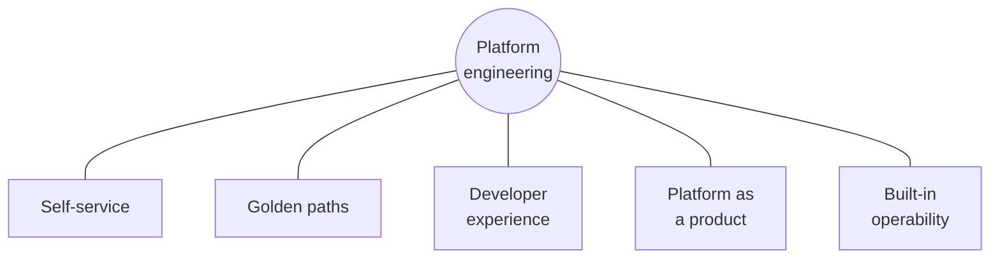

# Chapter 2 — The five pillars of platform engineering

## Naming the shape from Chapter 1

Chapter 1 described a platform team's job as four things done centrally
instead of left to each crew: issuing permits, enforcing a code,
regulating hookups, and requiring inspection. That description has a
fuller, more standard shape to it — one that shows up fairly consistently
across the industry, usually described as five responsibilities. Think of
these five as the lens the rest of this book keeps looking through, no
matter which repo a given chapter is about.

1. **Self-service.** A team that needs something from the platform should
   be able to get it by declaring what they need, not by filing a ticket
   and waiting for a person to do it for them.
2. **Golden paths** (also called paved roads). A well-supported default
   way of doing something, easy to follow and hard to get wrong by
   accident, so nobody has to invent their own version from scratch.
3. **Developer experience.** Reducing the friction and mental overhead on
   the people using the platform, so their time goes toward their own
   work instead of learning platform internals they don't actually need
   to know.
4. **Platform as a product.** Treating the platform team's output as a
   real product with real customers, not an internal utility nobody has
   to bother improving.
5. **Built-in operability.** A platform should be observable and operable
   from the start — not something bolted on after it's already running.

## Which of these have you already seen?

You don't have to take pillar one on faith. You demonstrated it yourself,
one page ago.

<strong>Predict before reading on:</strong> which pillar did creating the platform-guide repo in Chapter 1 actually demonstrate?

Self-service. Getting a new repo required exactly one thing: adding a few
lines to `platform_team_values.yaml` and opening a pull request. Nobody
filed a ticket with a platform team and waited. Nobody on that team
clicked "New repository" by hand on your behalf. You declared what you
needed, and a program made it real.

The other four pillars aren't demonstrated yet — they're just named for
now, waiting for later parts of this book to show up as something real
you can point at, the same way self-service just did.

## A recap box — the first of many

Every Part in this book ends with a short box like this one, checking off
what's actually been shown so far versus what's just been named. It's
worth reading each one, because it's the easiest way to notice a concept
quietly reappearing later in a different repo, wearing a different name.

> **Part 1 so far**
> - ✅ Self-service — shown in Chapter 1 (creating this repo)
> - 🔲 Golden paths — named, not yet shown
> - 🔲 Developer experience — named, not yet shown
> - 🔲 Platform as a product — named, not yet shown
> - 🔲 Built-in operability — named, not yet shown

## One pillar this project doesn't actually have

It's worth being honest about built-in operability specifically, rather
than letting it slide by as just another item on a list. This project
does not have it. There's no monitoring, no alerting, and no dashboard
showing whether any of the clusters built later in this book are healthy
right now — beyond running a command by hand and reading what it says.

That's a real, current gap, not something later chapters are quietly
going to reveal was secretly handled all along. It's worth knowing the
difference between a pillar you can watch actually working in this
project and one that's just been named so far — the recap boxes will keep
that distinction honest as you go.

---

**Next:** [Chapter 3 — Bounded contexts](03-bounded-contexts.md)
