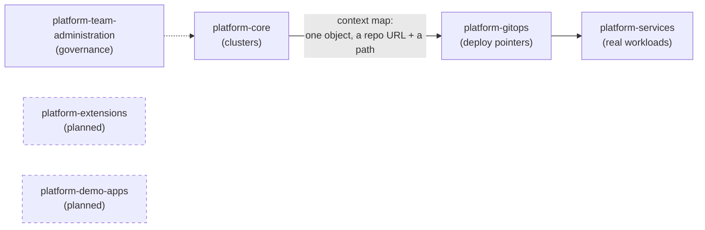

# Chapter 3 — Bounded contexts: why (eventually) six repos, not one

## The idea, from scratch

This project is split into several separate repos rather than one big one.
That split isn't arbitrary — there's a concept from software design that
explains exactly why it's the right call, called a **bounded context**,
from a field called Domain-Driven Design.

Here's the idea, built up from nothing. A **domain** is the whole problem
you're solving — here, running a platform that other engineering teams
build on. Different parts of that problem need different vocabulary to do
their own job well, and trying to force one shared vocabulary across the
whole thing usually makes every part of it worse, not clearer. A
**bounded context** is a boundary drawn around one part of the system
where a word has exactly one meaning. Step across that boundary into
another part of the system, and the same word is allowed to mean
something completely different. That's not sloppiness. It's the entire
point — each part gets to keep its own language simple, instead of
carrying baggage from a definition it doesn't actually need.

The specific, consistent vocabulary that holds inside one bounded context
— where "environment" means exactly one thing, and everyone working in
that context agrees on it without having to ask — has its own name too:
**ubiquitous language**. It only has to be ubiquitous *within* the
boundary. Nobody promised it travels.

## Watching this happen with one real word

The clearest way to see this is with a word this project uses constantly:
**environment**.

- In one repo, an environment is an entire, separate Kubernetes cluster —
  its own network, its own control plane, its own everything.
- In another repo, an environment is just a folder that a tool watches.
  No cluster, no network. Just a path.

Both are correct, fully, inside their own repo. If you tried to force one
single definition of "environment" across this whole project, you
wouldn't make anything clearer — you'd just make each repo's own model
worse, because one repo has no real reason to know what a Docker network
is, and the other has no real reason to know what a Kustomize overlay is.
Keeping the boundary sharp is exactly what keeps each side simple.

This word actually means a *third* thing too, once you look at what gets
produced from those folders — and untangling all three properly is worth
a full chapter on its own. Part 4 of this book does exactly that, in much
more depth than this paragraph can. For now, just hold onto the shape of
the idea: the same word, several honest meanings, each one correct where
it's used.

## The thin interface between two bounded contexts

If every part of the system uses its own private vocabulary, how does
anything connect at all? Through something Domain-Driven Design calls a
**context map** — a small, deliberately narrow interface that lets two
bounded contexts work together without either one having to understand
the other's internal model.

You'll meet this for real in Part 3: the connection between the repo that
builds Kubernetes clusters and the repo that watches for what to deploy
onto them is a single kind of object, carrying nothing but a repository
URL and a path. The cluster-building repo never needs to understand
folder structures or tenant setups on the other side. The interface stays
that thin on purpose — the whole benefit of a bounded context disappears
the moment two contexts start reaching into each other's internals to get
something done.



## Four repos today, six eventually

If you look closely at the platform team's own configuration file, you'll
actually find six repos declared, not four:
`platform-team-admin`, `platform-core`, `platform-gitops`,
`platform-services` — the four this book covers — plus
`platform-extensions` and `platform-demo-apps`, both real, both already
created, both still empty. They're planned for later, built out the same
way the rest of this project was: one piece at a time, from the same
source material. This book is expected to grow two more Parts once they
exist. For now, "why four repos" is really "why four bounded contexts so
far, out of six planned" — a roadmap, not a gap.

## Try it yourself — seeing the boundary, not just reading about it

```console
$ gh repo list phrankson --limit 8
phrankson/platform-guide          public
phrankson/platform-team-admin     public
phrankson/platform-gitops         public
phrankson/platform-services       public
phrankson/platform-core           public
phrankson/platform-extensions     public
phrankson/platform-demo-apps      public
```

Now look at the top level of each of the four built repos, side by side:

```console
$ ls platform-team-administration
config  docs  learning  modules  scripts  secrets-setup  tests  __main__.py  ...

$ ls platform-core
docs  learning  modules  scripts  tests  __main__.py  ...

$ ls platform-gitops
docs  environments  learning  README.md

$ ls platform-services
charts  docs  environments  learning  manifests  policy  scripts  smoke  README.md
```

Notice `platform-gitops` has no `modules/`, no `tests/`, no `scripts/` —
because it doesn't need any of that. It's not an incomplete version of
the other repos. It's a fully-formed answer to a much narrower question:
which folder points at which repo. That's a bounded context, made
visible in a plain `ls` output rather than left as an abstract claim.

## Part 1 recap

> **What you've picked up so far**
> - ✅ Self-service — shown in Chapter 1
> - 🔲 Golden paths, developer experience, platform as a product,
>   built-in operability — named in Chapter 2, still waiting to be shown
> - ✅ Bounded contexts — shown in this chapter, with a real `ls` output
>   proving each repo's shape fits its own job
> - ✅ Context maps — named here, will be seen as a real object in Part 3
> - ✅ Declarative infrastructure — demonstrated across all of Chapter 1's
>   hands-on section

Part 2 picks up where Chapter 1 left off: inside
`platform-team-administration` itself, looking at exactly what that
`Repository` and `BranchProtection` object Pulumi just created actually
enforce, and a real deadlock this project hit when two individually
correct rules collided with each other.

---

**Next: Part 2 — Governance**
