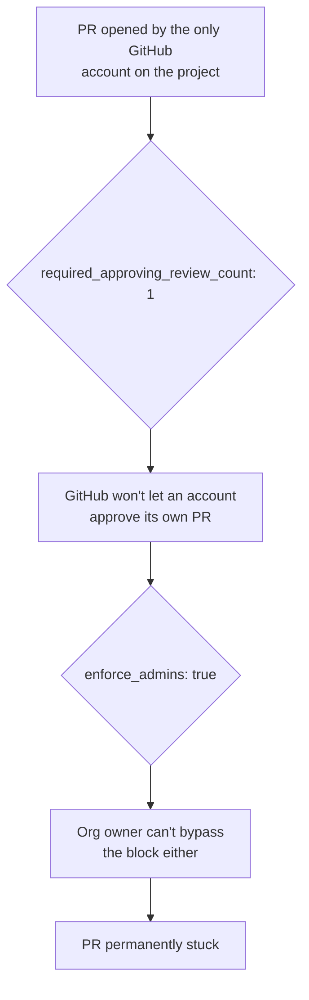

# Chapter 4 — Permits and blueprints

## Picking up where the capstone left off

Chapter 1 ended with a single `pulumi up` that created two things in the
same apply, back to back:

```console
+  github:index:Repository platform-guide created (7s)
+  github:index:BranchProtection platform-guide-main-branch-protection created (3s)
```

The first line made sense immediately — that's the book you're reading
right now, and you watched the pull request that declared it. The second
line got a lot less attention at the time; it just scrolled by as
"14 unchanged, 2 created" and the chapter moved on. This chapter is what
that second line actually does, in detail, plus a real incident this
project hit the first time two of its own rules turned out to be
individually correct and, together, impossible.

## The permit — github.Repository

A permit isn't the building. It's a record — tracked, numbered, tied to a
specific project — that a parcel now legally exists and belongs to
someone. `github.Repository` is that record for every repo this project
has:

```python
repo = github.Repository(
    repo_name,
    name=repo_name,
    description=repo_description,
    visibility=visibility,
    allow_auto_merge=False,
    delete_branch_on_merge=False,
    opts=ResourceOptions(
        provider=github_provider,
        protect=True,  # prevents accidental deletion via pulumi destroy
    ),
)
```

That `protect=True` is worth pausing on, because it's a deliberate
exception to how Pulumi normally behaves. Pulumi's whole pitch is that the
code is the source of truth — delete a resource's declaration, and the
real thing goes with it. For most resources that's exactly what you want:
delete the line declaring a namespace, and recreating it later costs
nothing. A repository is a different order of consequence. Years of
commit history and every issue ever filed disappear with it, and there's
no `pulumi up` that brings them back. `protect=True` is the one place this
project tells Pulumi "normal rules don't apply here" — a permit that
can't be torn up by editing a YAML file.

## The building code — github.BranchProtection

A permit alone doesn't guarantee anything gets built safely. That's what a
building code is for: one fixed set of rules, applied the same way to
every project, regardless of who's building or how much they trust their
own judgment that day. `github.BranchProtection` is this project's
building code, attached to `main` the moment each repo is created:

```python
github.BranchProtection(
    f"{repo_name}-main-branch-protection",
    repository_id=repo.node_id,
    pattern="main",
    enforce_admins=True,
    require_signed_commits=True,
    required_pull_request_reviews=[
        github.BranchProtectionRequiredPullRequestReviewArgs(
            dismiss_stale_reviews=True,
            required_approving_review_count=required_approving_review_count,
        )
    ],
    opts=ResourceOptions(provider=github_provider, depends_on=[repo]),
)
```

`depends_on=[repo]` is a small line worth understanding on its own terms,
because it says something general about how Pulumi works, not just about
this file. Pulumi doesn't run your Python top to bottom the way a script
does — it builds a graph of what depends on what first, and only creates a
resource once everything it needs already exists. Here, that guarantees
the permit exists before the inspector shows up. Without it, Pulumi would
be free to try attaching a building code to a parcel that isn't there yet.

Two of these settings deserve more than a glance, because *why* they work
matters more than *that* they exist.

`require_signed_commits=True` changes what a commit is actually claiming.
An ordinary commit says "this came from whoever typed this git config" —
a plain-text assertion, about as trustworthy as a name written in pencil
on a permit application. A signed commit is different: the committer holds
a private key nobody else has, and every commit gets a cryptographic seal
that only that key could have produced. Anyone can check the seal is
genuine without ever touching the private key — the same way a wax seal
pressed by a one-of-a-kind signet ring proves who sent a letter, without
the recipient needing to have met the sender. An auditor asking "prove
this person wrote this" gets a cryptographic answer instead of "we trust
our git config."

`enforce_admins=True` is the uncomfortable one. A codes department that
exempts its own director from the building code isn't really enforcing a
code — it's enforcing a suggestion with an escape hatch. So the correct
default is that even the person who wrote the rule has to follow it. That
correctness ran straight into reality within days, on a repo maintained
by exactly one person.

## When two correct rules collide

<details>
<summary><strong>Predict before reading on:</strong> <code>enforce_admins</code> is on. <code>required_approving_review_count</code> is <code>1</code>. There is exactly one GitHub account attached to this entire project — the same account that opens every pull request. What happens when that account tries to merge its own change?</summary>

GitHub itself refuses to let an account approve its own pull request —
that's not a setting anyone chose, it's just how the platform behaves. So
the PR needs one approval to merge, the only human on the project can't
provide it, and `enforce_admins` means the org owner can't override the
block either. The PR sits stuck — not because anything is broken, but
because two individually correct rules ("require a review," "don't let
admins skip rules") combine into a deadlock the moment there's only one
person around.

</details>



The fix wasn't to weaken either rule. Turning off `enforce_admins` would
have solved this one deadlock by quietly recreating the exact problem it
exists to prevent. The real fix was noticing that the hardcoded `1` was
silently assuming a team size — more than one person — that didn't exist
yet, and turning that assumption into a config value instead of a
constant buried in the Python:

```python
required_approving_review_count: int = data.get("branch_protection", {}).get(
    "required_approving_review_count", 1
)
```

```yaml
# required_approving_review_count: 0 while solo-maintaining with a single
# GitHub account (self-approval isn't allowed and enforce_admins blocks
# bypassing it). Raise back to 1+ once a second reviewer/collaborator exists.
branch_protection:
  required_approving_review_count: 0
```

What actually changed here is worth sitting with. This isn't a workaround
stacked on top of the rule — it's the rule being made to honestly reflect
a real constraint the hardcoded `1` had been quietly pretending wasn't
relevant. It's a common shape of bug in governance code specifically: a
rule that's exactly correct for the org you'll eventually have, and
silently wrong for the org you actually have today.

## Why every repo ended up public

One more constraint, lower-drama but worth knowing: GitHub's Free plan
cannot apply branch protection to a private repository at all — the
feature only exists on the Free tier for public repos. Every repo in this
project is `visibility: public` for exactly that reason. It reads like a
security posture decision. It's actually a plan-tier limit that quietly
decided a visibility question that had nothing to do with security in the
first place.

## Try it yourself — reading the live building code on your own repo

This isn't hypothetical for you specifically. `platform-guide` — the
repo holding the words you're reading — got exactly this building code
attached the moment it was created back in Chapter 1. You can read it
directly, live, right now:

```console
$ gh api repos/phrankson/platform-guide/branches/main/protection \
    --jq '{enforce_admins: .enforce_admins.enabled, signed_commits: .required_signatures.enabled, reviews_required: .required_pull_request_reviews.required_approving_review_count}'
{
  "enforce_admins": true,
  "signed_commits": true,
  "reviews_required": 0
}
```

That `reviews_required: 0` isn't a different rule for this repo — it's the
same fix from the deadlock above, still in effect, because this project is
still one person. The moment a second collaborator joins, that number goes
back up, and this exact command will show it.

---

**Next:** [Chapter 5 — Two inspectors](05-two-inspectors.md)
