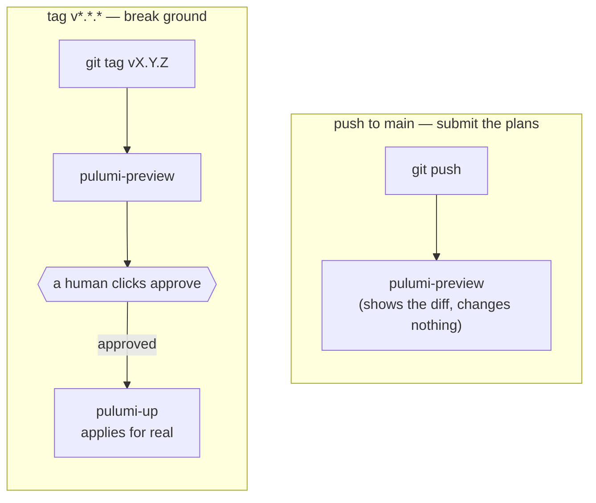

# Chapter 5 — Two inspectors

## Two layers, on purpose

Chapter 1 named four things a buildings department does centrally:
issuing permits, enforcing a code, regulating utility hookups, and
requiring inspection before occupancy. Chapter 4 covered the first two —
the repo itself, and the `BranchProtection` rule attached to it. This
chapter covers the other two, plus something Chapter 1's list didn't
mention at all: a second, much smaller inspector that runs before the
first one ever gets involved.

A construction crew doesn't wait for the city to catch every mistake.
They keep their own checklist on-site — hard hats, scaffolding bolted
right, wiring double-checked — before anyone calls to schedule the real
inspection. That checklist catches problems early, while they're still
cheap to fix. It's also just a clipboard hanging on a nail: a crew in a
hurry can skip it, and nothing physically stops them. The city's actual
inspector arrives later and moves slower, but can't be argued with,
rushed, or skipped. That's the real backstop.

This project has both layers, and the interesting question isn't which
one to pick — it's why you'd ever want both instead of just the strict
one.

- **`.git-hooks/commit-msg`** is the crew's own clipboard. It runs on
  *your* machine, the instant you commit, rejecting a message that
  doesn't follow [Conventional Commits](https://www.conventionalcommits.org/)
  (`type(scope): description`) before the commit even finishes being
  made. Fast, no network round-trip, catches the mistake at the cheapest
  possible moment. And exactly as skippable as a clipboard on a nail —
  `git commit --no-verify` walks straight past it, and so does simply
  never installing it after cloning the repo.
- **`github.BranchProtection`**, from Chapter 4, is the city inspector.
  It runs server-side, on GitHub's own machines, on every push regardless
  of whose laptop it came from or what shortcuts they took locally. This
  is the layer the `enforce_admins` deadlock actually collided with —
  because unlike the clipboard, there's no local flag that talks it out
  of doing its job.

## Try it yourself — watching both layers, live

Git never syncs `.git/hooks/` between clones. That's not an oversight —
it's local machine state by design, which is exactly why
`scripts/install-githooks.sh` exists as its own explicit step: copy the
hook from the tracked `.git-hooks/` folder into the untracked
`.git/hooks/` location git actually reads from.

```console
$ ./scripts/install-githooks.sh
Successfully installed commit-msg hook
Git hooks installation complete
  Source:  .../platform-team-administration/.git-hooks
  Target:  .../platform-team-administration/.git/hooks
Commit messages will now be validated for conventional commits format

$ git commit --allow-empty -m "fixed stuff"
Error: Commit message does not follow conventional commits format

Valid format: type(scope)?: description

Allowed types: build, chore, ci, docs, feat, fix, perf, refactor, revert, style, test
```

Rejected locally, instantly, before the commit exists at all — and just
as instantly bypassable with `--no-verify` if someone's in a hurry. That
last fact isn't a flaw in the hook. It's the entire reason this layer
alone would never be enough by itself, and why Chapter 4's server-side
rule has to exist too.

## Utility hookups: why secrets can't just live in the repo

A construction crew doesn't run an illegal tap into the city water main
themselves — utilities get connected through a permitted, audited
process, with a specific account accountable for what flows through it.
Secrets, here, are the same category of thing: something the system
needs in order to function, that nobody gets to just wire in on their
own.

The reason this isn't optional tidiness comes down to one fact worth
knowing cold: **git never truly deletes anything.** Commit a secret once,
even if the very next commit removes it, and it stays retrievable forever
in that repo's history, by anyone who ever clones it — short of
surgically rewriting the entire history and somehow tracking down every
existing clone to fix too. That's why Pulumi's GitHub token doesn't live
in this repo, or in an env file checked into git, or anywhere version
control can see it. It lives in Bitwarden, and
`secrets-setup/load_secrets.sh` is the one-way door that gets local
secret *definitions* — never the actual values — into the vault.

The script's core logic is a plain create-or-update loop: for each secret
definition, if an item with that exact name already exists in the vault,
update it; otherwise create a new one. The word "exact" turned out to be
carrying more weight than it looked like it should.

<details>
<summary><strong>Predict before reading on:</strong> Bitwarden's CLI has a lookup command, <code>bw get item &lt;name&gt;</code>, that does <em>fuzzy</em> matching — it returns the closest-named item, not necessarily an exact one. If a script uses that command to check "does an item called 'Pulumi Secrets' already exist," in a vault that already has an item called "GitHub Secrets," what can go wrong?</summary>

This happened for real, on the actual vault this project uses. Creating a
new item named "Pulumi Secrets" through a `bw get item`-based lookup
fuzzy-matched onto the existing "GitHub Secrets" item — close enough for
Bitwarden's matcher — and the update branch of the loop overwrote it with
the new item's contents. The GitHub Secrets item didn't get created
alongside the old one. It got replaced by it.

The fix, already in place in the script now, drops the fuzzy lookup for
an exact-match filter:

```bash
# bw get item does a fuzzy/word match, not an exact-name lookup, which can
# collide with unrelated items in a large vault. List + exact-match instead.
existing_item=$(bw list items --search "$item_name" --session "$BW_SESSION" 2>/dev/null \
    | jq --arg n "$item_name" '[.[] | select(.name == $n)] | first // empty')
```

`bw list items --search` still runs a broad search — but piping the
results through `jq`'s `select(.name == $n)` throws out every result that
isn't a byte-for-byte name match before anything gets treated as "the
item that already exists." The lost item wasn't unrecoverable in this
case — it got recreated from a local file — but the lesson outlives
Bitwarden entirely: any time a tool's "find by name" is fuzzy, "does X
exist" and "find the thing named X" are two different operations.
Treating them as one is how automation quietly destroys data nobody asked
it to touch.

</details>

You can see the two behaviors side by side without touching a real vault
at all:

```console
$ echo '[{"name":"GitHub Secrets","id":"a1"},{"name":"Pulumi Secrets","id":"b2"}]' \
    | jq --arg n "Pulumi Secrets" '[.[] | select(.name == $n)] | first'
{
  "name": "Pulumi Secrets",
  "id": "b2"
}

$ echo '[{"name":"GitHub Secrets","id":"a1"},{"name":"Pulumi Secrets","id":"b2"}]' \
    | jq --arg n "Pulumi" '[.[] | select(.name == $n)] | first'
null
```

The exact match finds the right item and only the right item. The fuzzy
fragment — the shape of query `bw get item` would have run — comes back
empty, which is the whole guard working correctly: better to find nothing
than to find the wrong thing and act on it.

## Inspection before occupancy: push vs. tag

A building doesn't go from blueprint to occupied in one step. Plans get
submitted and reviewed first — no groundbreaking yet, just "here's what
we intend to build, tell us if anything's wrong with it." Only once
that's approved does anyone actually break ground.
`.circleci/config.yml` encodes exactly that two-phase shape using two
different git triggers:



```console
$ grep -A3 "tag_main:" .circleci/config.yml
  tag_main: &tag_main
    filters:
      tags:
        only: /^v.*/
```

The idea underneath this is worth knowing independent of CircleCI or
Pulumi specifically: deployment needs friction placed deliberately at
exactly one point, not scattered across every step and not removed
entirely. Zero friction — every push deploys instantly — means a bad
change is live before anyone sees it coming. Friction at every step means
nothing ships fast enough to be useful, and people start finding ways
around the process out of plain impatience. The right amount of friction
sits at the one step with real, hard-to-reverse consequences — here,
that's a semver tag plus a human clicking approve — while every earlier
step stays instant and automatic, because a preview can't hurt anything
on its own.

---

**Next:** [Chapter 6 — Governance at scale](06-governance-at-scale.md)
