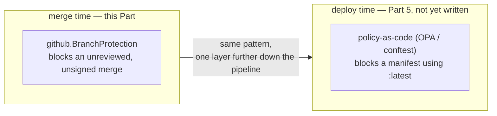

# Chapter 6 — Governance at scale

## The pattern, named

Step back from the specific rules for a moment and look at the shape
underneath them. At a small enough scale, a team lead can personally
review every pull request and hold every rule in their head at once —
who needs to approve what, which repos are allowed to skip which checks,
what happened last time someone forgot to sign a commit. That works right
up until it doesn't. Add enough teams and enough repos, and no single
person can carry all of that anymore, and nobody should have to.

**Governance at scale** is what replaces that person: the platform
enforcing a rule uniformly, by machine, regardless of team size,
seniority, or how busy someone happens to be that week. You've already
watched this happen twice in this Part, not just heard it described.
`github.BranchProtection` doesn't get configured by a human remembering
to click through GitHub's settings page for each new repo — it gets
attached automatically, from one YAML entry, the instant `pulumi up`
notices a repo exists without it. The self-approval deadlock in Chapter 4
is what this pattern feels like from the inside when it collides with an
edge case nobody had gotten to yet: not a rule failing, but a rule
succeeding at being genuinely uniform, in a situation where uniform
turned out to be inconvenient.

That's the whole idea. It's small here — one rule, one branch pattern,
four repos. It gets a lot more interesting once it's applied somewhere
with real consequences attached to getting it wrong.

## One layer further down

Branch protection governs exactly one moment: how code gets from a pull
request into `main`. It has nothing to say about what happens after
that — what actually gets built from that code, or what ends up running
on a cluster somewhere. That's a different moment, governed by a
different mechanism, and it's where this same pattern shows up again.

`platform-services`, covered later in this book, uses policy-as-code —
rules written once, checked automatically against every deployment,
written using tools called OPA and conftest. One of those rules rejects
any Kubernetes manifest that uses an unpinned `:latest` image tag. Notice
what's identical about this and everything in this Part: nobody is
manually reviewing every manifest for that mistake, the same way nobody
is manually reviewing every branch protection setting on every repo here.
A rule gets written down once, and a machine checks it every single time,
automatically, whether the person deploying is the platform team's most
careful engineer or someone doing it for the first time under deadline
pressure.

Part 5 also tells that story honestly, including a real coverage gap in
those policy checks — the same honesty this Part applied to the
self-approval deadlock instead of pretending the fix was obvious from the
start. For now, just hold onto the shape: governance at scale isn't a
GitHub-specific idea, and it isn't finished once `main` is protected. It's
a pattern that keeps reappearing anywhere a platform has to make a rule
stick without a person standing there enforcing it by hand.

## Part 2 recap

> **Part 2 — Governance**
> - ✅ Self-service — reinforced in Chapter 4: the same YAML edit that
>   creates a repo creates its branch protection alongside it, with
>   nobody clicking through GitHub's settings to set either one up
> - 🔲 Golden paths — still just named
> - 🔲 Developer experience — still just named
> - ✅ Platform as a product — shown in Chapter 4: the self-approval
>   deadlock got fixed by making the rule honestly fit the team size that
>   actually exists, not by weakening the guarantee or shipping a
>   workaround
> - 🔲 Built-in operability — still the same real gap named in Chapter 2
> - ✅ Two-layer enforcement — shown in Chapter 5: a fast, skippable local
>   git hook and a slower, unskippable server-side check, deliberately
>   both, not one instead of the other
> - ✅ Governance at scale — named and shown in this chapter; Part 5
>   applies the identical pattern to what actually gets deployed, via
>   policy-as-code

Four pillars now have at least one real example behind them instead of
just a name. Golden paths, developer experience, and built-in operability
are still waiting — the next Part, where clusters actually get built, is
where the first of those starts to show up for real.

---

**Next: Part 3 — Building the house**
