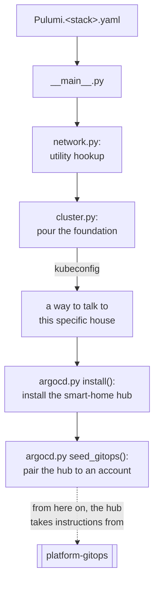

# Chapter 7 — Three houses, not three rooms

## Remember the environment example from Chapter 3?

Part 1, Chapter 3 introduced the word "environment" and deliberately left
it half-explained. It said an environment means an entire, separate
Kubernetes cluster in one repo, and a folder that a tool watches in
another — and promised that the cluster meaning would get shown properly
later, once there was an actual repo whose whole job is building
clusters. This is that repo. This chapter is that promise kept.

`platform-team-administration`, the repo Part 2 covered, declared three
permits worth of nothing: `platform-sandbox`, `app-dev`, and `app-prod`
exist so far only as empty, protected GitHub repos. `platform-core` — the
repo this whole Part is about — is where each of those permits becomes an
actual, running, local Kubernetes cluster, built with
[Kind](https://kind.sigs.k8s.io/) (Kubernetes **in** Docker).

## Three houses, not three rooms in one house

It's tempting to picture "three environments" as three rooms inside one
shared building — say, three namespaces inside a single cluster, each one
labeled `sandbox`, `dev`, or `prod`. That's not what gets built here, and
the difference matters more than it sounds.

<details>
<summary><strong>Predict before reading on:</strong> what actually breaks if <code>app-dev</code> and <code>app-prod</code> are two namespaces in the same cluster, instead of two entirely separate clusters?</summary>

Namespaces share almost everything above the namespace boundary: the same
control plane, the same node pool, the same network, the same set of
cluster-scoped objects (`CustomResourceDefinition`s, `ClusterRole`s,
admission webhooks). A misconfigured resource quota, a runaway pod
starving the node of memory, a cluster-scoped policy pushed with a typo —
any of these can degrade or take down every namespace on that control
plane at once, `prod` included, even though nobody touched `prod`'s own
namespace directly. Three separate clusters mean `app-dev` and `app-prod`
don't share so much as a network interface. Nothing running in one can
see, reach, or accidentally starve anything in the other, because there's
no shared "above the namespace" layer left for a mistake to leak through.
</details>

Each of the three houses is its own complete set of Docker containers,
running its own separate Kubernetes control plane, on its own separate
Docker network. Not three rooms — three separate houses on three separate
lots, built the same way, but with nothing connecting them once they
exist.

## Why local Kind clusters at all

This project runs entirely on Kind rather than a real cloud provider's
managed Kubernetes, and that choice is deliberate, not a placeholder for
"real" infrastructure later. Kind runs an entire Kubernetes cluster —
control plane and worker nodes included — as plain Docker containers on
one machine. That makes every cluster in this project disposable and
free: no cloud bill for keeping three clusters running, no waiting on a
cloud provider to provision anything, and `kind delete cluster` undoes a
mistake completely in seconds. For a project meant to be run, broken, and
rebuilt by a reader following along, that tradeoff is exactly right — the
same three-cluster architecture this chapter describes would work
unchanged against a real cloud provider's Kubernetes offering; only the
tool pouring the foundation would change.

## One blueprint, three houses

Every one of the three houses is built from the exact same code —
[`__main__.py`](https://github.com/phrankson/platform-core/blob/main/__main__.py)
— with different measurements plugged in per house from
`Pulumi.platform-sandbox.yaml`, `Pulumi.app-dev.yaml`, and
`Pulumi.app-prod.yaml`:



Everything left of the dotted line is this Part's story — building each
house, once per house. What the hub does once it's paired belongs to a
different repo, in Part 4. That handoff point is the single most
important idea in this whole codebase, and the rest of this Part builds
up to exactly why the line is drawn there.

Confirming these three houses are real, separate, and running right now,
not just described in a config file:

```console
$ kubectl config get-contexts
CURRENT   NAME              CLUSTER           AUTHINFO          NAMESPACE
          kind-app-dev      kind-app-dev      kind-app-dev
          kind-app-prod     kind-app-prod     kind-app-prod
*         kind-pe-sandbox   kind-pe-sandbox   kind-pe-sandbox

$ kubectl --context kind-pe-sandbox get nodes
NAME                       STATUS   ROLES           AGE     VERSION
pe-sandbox-control-plane   Ready    control-plane   4d17h   v1.31.0
pe-sandbox-worker          Ready    <none>          4d17h   v1.31.0

$ kubectl --context kind-app-dev get nodes
NAME                    STATUS   ROLES           AGE     VERSION
app-dev-control-plane   Ready    control-plane   2d19h   v1.31.0
app-dev-worker          Ready    <none>          2d19h   v1.31.0

$ kubectl --context kind-app-prod get nodes
NAME                     STATUS   ROLES           AGE     VERSION
app-prod-control-plane   Ready    control-plane   2d19h   v1.31.0
app-prod-worker          Ready    <none>          2d19h   v1.31.0
```

Three separate control planes, three separate sets of nodes, three
separate ages (each was built at a different time, which is itself proof
they're independent — nothing forces them to be created or torn down
together).

One naming wrinkle worth flagging early, because it resurfaces in Chapter
10: the sandbox house's Kind cluster is named `pe-sandbox`, but its
Pulumi stack is named `platform-sandbox`. The two names diverge on
purpose, and which one to use where turns out to matter.

---

**Next:** [Chapter 8 — Utility hookups](08-utility-hookups.md)
