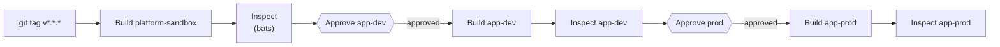

# Chapter 11 — Proving it works

## An inspector who doesn't take the crew's word for it

`pulumi up` reporting success only means Pulumi's own steps finished
without error — it's the crew saying "we're done." It says nothing about
whether the house actually works. An independent inspector doesn't read
the crew's paperwork and nod; they walk through and check the utilities
themselves.

[`tests/integration/infrastructure.bats`](https://github.com/phrankson/platform-core/blob/main/tests/integration/infrastructure.bats)
is that inspector. It fetches the house's real kubeconfig from Pulumi's
own stack outputs, then checks — using a completely different tool than
the one that built anything — that the Docker network actually exists
and `kubectl get nodes` actually returns a working node:

```console
$ export PULUMI_STACK=platform-sandbox
$ bats tests/integration/infrastructure.bats
1..2
ok 1 docker network exists
ok 2 kubernetes cluster is accessible
```

Proof from an outside party, not the builder grading its own work.

This is also a concrete example of something usually described in
developer-workflow terms as the outer loop. The **inner loop** is what a
developer does on their own machine before anything gets shared —
changing code, rerunning it, checking the result, over and over, as fast
as possible. The **outer loop** is everything that happens after a change
is pushed: building it, deploying it, and verifying it actually works in
a real environment. These bats tests are outer-loop work. They only run
after `pulumi up` has already deployed something real, checking it from
the outside rather than trusting the deploy's own exit code.

## Smaller corrections, worth knowing without needing their own story

A few lower-stakes things this project learned the hard way, that don't
need a full incident to be useful:

- **`pulumi stack init <name>` does not create `Pulumi.<name>.yaml`** — a
  common assumption that turns out to be wrong. That file only appears
  after the first `pulumi config set` or `pulumi preview`/`up` against
  that stack.
- **`mypy` hangs indefinitely** on this codebase without
  `--follow-imports=skip` — it chases into `pulumi_kubernetes`'s enormous
  generated SDK otherwise. The real `lint-code` command in
  [`.circleci/config.yml`](https://github.com/phrankson/platform-core/blob/main/.circleci/config.yml)
  carries the flag, and a comment explaining exactly why, right next to
  it:

  ```yaml
  # --follow-imports=skip: without it, mypy chases into
  # pulumi_kubernetes's enormous generated SDK and hangs.
  mypy __main__.py modules/ --ignore-missing-imports --follow-imports=skip
  ```

- **`isort` and `black` disagree by default** on blank lines around
  individually-commented imports — a common formatter fight any time both
  tools run on the same codebase. Fixed once, project-wide, with two
  lines in
  [`.isort.cfg`](https://github.com/phrankson/platform-core/blob/main/.isort.cfg):

  ```console
  $ cat .isort.cfg
  [settings]
  profile = black
  ```

  `profile = black` tells isort to match black's own formatting opinions
  instead of its own defaults, so the two tools stop fighting over the
  same lines.

## Promoting through three houses, with two checkpoints

`.circleci/config.yml` extends the review-then-build pattern Part 2
covered in `platform-team-administration` across all three houses, with a
checkpoint between each promotion — because promoting through `app-dev`
before `app-prod` is the entire reason three environments exist instead
of one:



Every build step is followed immediately by its own independent
inspection before the next approval checkpoint even becomes available —
a house is never promoted on the builder's word alone, and a problem
caught in `app-dev` never even reaches the door of `app-prod`.

This pattern has a name: **progressive delivery**. Instead of pushing a
change everywhere at once, it moves through environments of increasing
consequence, one at a time, with a real check between each move. A
mistake gets caught in the cheapest, least consequential environment
available, long before it reaches the one where a mistake actually costs
something. Part 5 of this book, not yet written, shows this identical
pattern again, in a completely different setting: an Istio version bump,
rolled through the same three environments one at a time instead of
everywhere at once. Same shape, different thing being promoted.

## Part 3 recap

> **What Part 3 added**
> - ✅ Self-service — shown already in Part 1
> - ✅ Golden paths — shown in this Part: one `__main__.py` blueprint,
>   reused identically to build all three houses, with CI enforcing the
>   same promotion path through every one of them
> - 🔲 Developer experience, Platform as a product — still just named
> - 🔲 Built-in operability — still absent, and named out loud again in
>   Chapter 10 (nobody pages Argo CD's own health if it goes down)
> - ✅ Environment = a whole separate cluster — the meaning Part 1
>   Chapter 3 promised would get shown properly once there was a repo
>   whose job is building clusters; shown in full in Chapter 7
> - 🔲 Environment = a folder — still just named; Part 4 shows this
> - ✅ Context maps — seen as a real object for the first time: the Argo
>   CD `Application` seeded in Chapter 10, carrying nothing but a
>   repository URL and a path
> - ✅ Progressive delivery — shown in this chapter's CI pipeline; Part 5
>   revisits the identical pattern for an Istio version bump
> - ✅ Inner loop / outer loop — shown in this chapter's bats tests
> - ✅ Infrastructure as code vs. configuration as code — shown as a real
>   boundary in Chapter 10, where Pulumi's own job stops
> - 🔲 Blameless postmortems, trigger vs. root cause — named in Chapter
>   10 against the inotify incident; Part 6 builds a full chapter around
>   this same incident from an SRE lens

Four houses' worth of permits from Part 2 are now three real, running
clusters, each paired to a smart-home hub that's already listening. Part
4 picks up exactly where Chapter 10 left off: what that hub actually
finds when it goes looking in `platform-gitops`, and the other meaning
of "environment" this Part deliberately left alone.

---

**Next: Part 4 — The filing cabinet**
