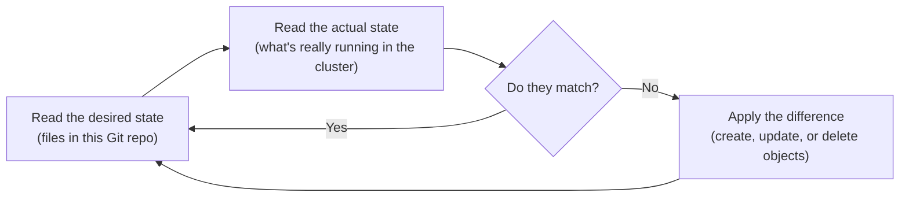

# Chapter 12 — What Argo CD actually does

## Picking up where the hub was left plugged in

Chapter 10 installed a smart-home hub in each house and paired it to one
account: a single Argo `Application` object, carrying nothing but a
repository URL and a path, pointing at this repo — `platform-gitops`. That
chapter stopped right there, at the moment the hub started listening. This
Part is about what it actually does with what it hears.

## The problem this solves

Without a tool like Argo CD, getting something running on a cluster
usually looks like: someone runs `kubectl apply -f some-file.yaml`, once.
That command finishes, and nothing is watching afterward. If someone later
runs `kubectl edit` and changes something by hand, or a bug quietly drifts
an object away from what was originally applied, nothing notices and
nothing corrects it. The cluster's real state and whatever's written down
in a YAML file somewhere can drift apart for weeks before anyone catches
it — and by then, the only record of what was actually *supposed* to be
running is someone's shell history or an old CI log.

GitOps is the name for a different approach: the source of truth for what
should be running lives in Git, and a tool continuously makes the real
cluster match it — not once, at deploy time, but forever, for as long as
that tool keeps running.

## A loop, not a command

This is the single most important idea in this whole Part, worth slowing
down on rather than reading past. A smart-home hub that's merely installed
isn't doing its job yet — it has to actually be checking, continuously,
whether the house still matches the account it was paired to. Argo CD is
exactly that: once paired, it runs a loop that never stops.



There is no "finished" state. Every few minutes, forever, the loop reads
Git, reads the cluster, compares the two, and fixes whatever's different.
This single behavior explains something that would otherwise look
strange: if someone manually edits an object Argo CD manages — patches a
`Deployment` directly with `kubectl`, say — the edit doesn't stick. It's
not that Argo CD is being stubborn. It's that the next pass of the loop
notices the live object no longer matches Git, and reverts it, the same
way a hub would put a manually-moved smart light back to whatever
schedule the account actually specifies.

<details>
<summary><strong>Predict before reading on:</strong> if you ran <code>kubectl scale deployment platform-services --replicas=5 -n platform-services</code> against a live, Argo-CD-managed deployment, what would happen a few minutes later?</summary>

Nothing lasting. The scale command would take effect immediately — Kubernetes doesn't ask Argo CD's permission to accept an API call — but on Argo CD's next reconciliation pass, it would notice the live `replicas` field no longer matches what's declared in Git, and set it back. The file in Git is the only place a change is allowed to actually stick. This exact behavior has a name, `selfHeal`, and Chapter 14 shows the real field that turns it on.
</details>

The act of one pass of this loop actually running — compare, then apply
any difference — is called **reconciling**, and the loop itself is what
the rest of this Part calls the **reconciliation loop**. Argo CD
reconciles on its own schedule automatically, and it can also be
triggered by hand to skip the wait, which is exactly what several scripts
elsewhere in this project do during CI.

## Two different questions: sync status and health status

Reading an `Application` object's status means reading the answers to two
separate questions, easy to conflate but genuinely independent:

- **Sync status** answers "does the live cluster currently match what's
  declared in Git?" `Synced` means yes. `OutOfSync` means no, for whatever
  reason — often because something outside Argo CD changed the live
  object after Argo CD last applied it.
- **Health status** answers a completely different question: "is this
  object actually working right now?", regardless of whether it matches
  Git byte-for-byte.

An object can be `Healthy` and `OutOfSync` at the same time, and that's
not a contradiction — a pod can be running fine while some field on it
(an annotation added by a mutating webhook, say) no longer matches the
file that created it. You don't have to take that on faith; it's visible
on this project's own sandbox cluster right now.

## Seeing all of this live, right now

```console
$ kubectl --context kind-pe-sandbox get applications -n argocd
NAME                SYNC STATUS   HEALTH STATUS
istio-base          OutOfSync     Healthy
istio-ingress       Synced        Progressing
istiod              OutOfSync     Healthy
platform-gitops     Synced        Healthy
platform-services   Synced        Healthy
whoami-helm         Synced        Healthy
whoami-kustomize    Synced        Healthy
```

`istio-base` and `istiod` are exactly the `Healthy`-but-`OutOfSync` case
described above — real objects, working correctly, that still don't match
Git down to the last field. Part 5, not yet written, digs into exactly why
once it installs that same mesh. `istio-ingress` shows the opposite kind
of mismatch: `Synced` but only `Progressing`, meaning the live object
matches Git exactly, but whatever it's supposed to be doing (a rollout,
usually) hasn't finished settling yet.

`platform-gitops` is the row that matters most for this chapter — it's
the one object Chapter 10's `seed_gitops()` created directly, the pairing
instruction itself. Checking when it last actually reconciled proves the
loop diagram above isn't just a description, it's running, continuously,
right now:

```console
$ kubectl --context kind-pe-sandbox get application platform-gitops -n argocd -o jsonpath='{.status.sync.status}{"\n"}{.status.health.status}{"\n"}{.status.reconciledAt}{"\n"}'
Synced
Healthy
2026-08-28T14:26:00Z
```

Every other row in that first table, this repo never created directly —
Argo CD found those on its own, by following instructions inside
`platform-gitops`. That's the subject of the next two chapters: what
those instructions actually are, and the exact chain of files that
produces them.

## The vocabulary this chapter established

- **`Application`** — a Kubernetes custom resource that tells Argo CD
  three things: which Git repo to watch, which path or chart inside it to
  use, and where in the cluster to apply the result.
- **Sync status** — whether the live cluster currently matches Git.
- **Health status** — whether the object is actually working right now,
  independent of sync status.
- **Reconcile** — one pass of the loop: compare desired and actual state,
  apply any difference.

---

**Next:** [Chapter 13 — One cabinet, many drawers](13-one-cabinet-many-drawers.md)
