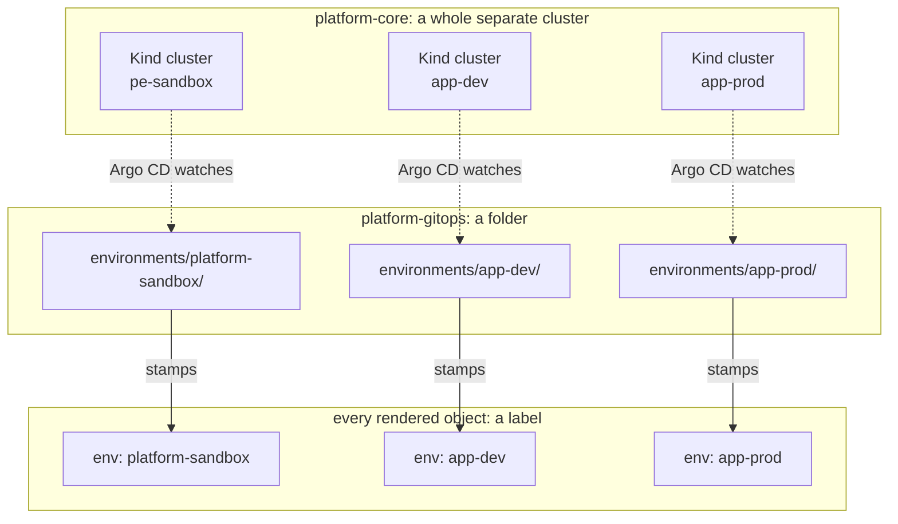

# Chapter 13 — One cabinet, many drawers: environments explained

## A promise from two chapters back, in two different Parts

Part 1, [Chapter 3](../part-1-foundations/03-bounded-contexts.md#watching-this-happen-with-one-real-word)
introduced the word "environment," deliberately half-explained it, and
made a specific promise: *"this word actually means a third thing too,
once you look at what gets produced from those folders — and untangling
all three properly is worth a full chapter on its own. Part 4 of this
book does exactly that."* Part 3, [Chapter 7](../part-3-building-the-house/07-three-houses-not-three-rooms.md#one-blueprint-three-houses)
kept one third of that promise — an environment as an entire, separate
Kind cluster — and its own Part recap left the rest marked open: *"🔲
Environment = a folder — still just named; Part 4 shows this."*

This chapter is where both of those get closed out, together, along with
the third meaning neither of those chapters showed at all.

## Three concrete things, one word

"Environment" isn't vague in this project. It means three specific,
concrete things, depending on which repo you're standing in when you say
it — and all three are correct at once, describing the same underlying
separation (`platform-sandbox`, `app-dev`, `app-prod`) from three
different layers.



**In `platform-core`, an environment is an entire separate cluster.**
Chapter 7 already showed this one in full — three independent Kind
clusters, sharing nothing above the namespace boundary, each with its own
control plane and its own Docker network. This is the heaviest-weight of
the three meanings, and it's the one most people mean when they first
hear the word "environment" in any project.

**In `platform-gitops` — this repo — an environment is a folder.**

```console
$ ls environments/
app-dev  app-prod  platform-sandbox

$ ls environments/platform-sandbox/
kustomization.yaml  tenants
```

`environments/platform-sandbox/` is the folder Argo CD reads when it's
running inside the `platform-sandbox` cluster. Nothing about the folder
itself knows or cares about Docker networks or Kind — it's just files
sitting in Git. You could read every file under `environments/` on a
laptop with no cluster running at all, and every word of it would still
make sense.

**Once rendered, an environment becomes a label.** Every object this
repo's Kustomize chain produces gets stamped with `env: <name>`, and
that stamping happens in exactly one place — the `labels:` block at the
very top of each environment's root `kustomization.yaml`:

```console
$ cat environments/platform-sandbox/kustomization.yaml
apiVersion: kustomize.config.k8s.io/v1beta1
kind: Kustomization

labels:
  - pairs:
      env: platform-sandbox
    includeSelectors: true
    includeTemplates: true

resources:
  - tenants
```

That `labels:` block is the whole mechanism. Everything pulled in through
`resources: [tenants]` — every tenant, every object any tenant declares —
inherits `env: platform-sandbox` automatically, without a single one of
those files needing to mention it. Checking a real, live object confirms
the label actually landed where the file says it should:

```console
$ kubectl --context kind-pe-sandbox get application platform-services -n argocd --show-labels
NAME                SYNC STATUS   HEALTH STATUS   LABELS
platform-services   Synced        Healthy         env=platform-sandbox
```

## Why this isn't three competing definitions

It's tempting to want one of these three to be the "real" one, with the
other two as loose shorthand for it. That instinct is worth resisting.
Chapter 3 named the underlying reason already: forcing one shared
vocabulary across bounded contexts that don't need each other's internals
makes each side worse, not clearer. A cluster is a real, physical thing
`platform-core` has to provision. A folder is how that cluster's desired
state gets organized in Git, where a filing system needs something to
organize *by*. A label is how Kubernetes lets you tell two rendered
objects apart at a glance, where a label just needs to be small enough to
staple to one object. None of the three is doing the other two's job
worse — each is doing its own job exactly right.

<details>
<summary><strong>Predict before reading on:</strong> Chapter 7 flagged a naming wrinkle — the sandbox cluster is named <code>pe-sandbox</code>, but its Pulumi stack (and this repo's matching folder) is named <code>platform-sandbox</code>. If you renamed the folder <code>environments/pe-sandbox/</code> to match the Kind cluster's own name, but left <code>seed_gitops()</code> in <code>platform-core</code> unchanged, what breaks?</summary>

Everything, silently. `seed_gitops()` pairs the hub using `path=f"environments/{pulumi.get_stack()}"` — the Pulumi stack name, `platform-sandbox`, not the Kind cluster's own name. Rename the folder and Argo CD would be told to watch a path that no longer exists. It wouldn't error loudly; it would just find nothing there, the same silent-failure shape Chapter 15 shows for an unlisted tenant. This is exactly why the three meanings need to be kept straight in your head rather than treated as interchangeable — the cluster's name and the folder's name are allowed to diverge, but the *pairing* only works because `platform-core` deliberately uses the folder's name (the Pulumi stack), not the cluster's.
</details>

## The habit worth building

Every time "environment" shows up anywhere in this project's docs, ask
which of the three it actually means — the cluster, the folder, or the
label. Once that's automatic, nothing about this project's file layout,
or the fact that three different repos all use the same word slightly
differently, will feel inconsistent. It's the same skill Chapter 3 named
first: a bounded context isn't a flaw to route around, it's what keeps
each layer's own model simple.

---

**Next:** [Chapter 14 — The App of Apps pattern](14-the-app-of-apps-pattern.md)
