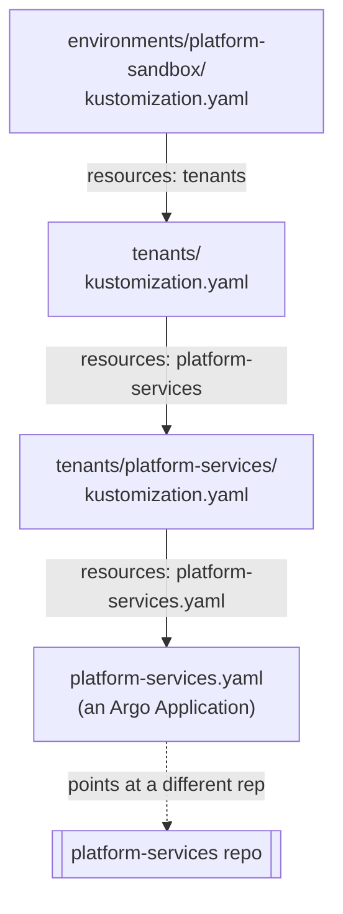

# Chapter 14 — The App of Apps pattern

## Following the chain, one file at a time

Chapter 10 paired the hub with exactly one instruction: watch
`environments/platform-sandbox`. Chapter 12 showed the loop that keeps
checking it. This chapter is about what's actually sitting inside that
folder — a chain of four small files, each one saying "also look here,"
until the chain finally ends at something that deploys a real workload.



## File one: the environment root

Chapter 13 already showed the top of this file — the `labels:` block that
stamps every rendered object with `env: platform-sandbox`. The other half
of the same file is what actually starts the chain:

```console
$ cat environments/platform-sandbox/kustomization.yaml
apiVersion: kustomize.config.k8s.io/v1beta1
kind: Kustomization

labels:
  - pairs:
      env: platform-sandbox
    includeSelectors: true
    includeTemplates: true

resources:
  - tenants
```

`resources: [tenants]` is the whole instruction: go look inside the
`tenants/` folder for whatever comes next.

## File two: the tenant list

```console
$ cat environments/platform-sandbox/tenants/kustomization.yaml
apiVersion: kustomize.config.k8s.io/v1beta1
kind: Kustomization

resources:
  - platform-services
```

This is the roster. Right now, exactly one name is on it. This file's job
is narrow on purpose — it says which tenants exist in this environment,
and nothing about what any of them actually want deployed.

## File three: the tenant's own folder

```console
$ cat environments/platform-sandbox/tenants/platform-services/kustomization.yaml
apiVersion: kustomize.config.k8s.io/v1beta1
kind: Kustomization

resources:
  - platform-services.yaml
```

Still boring, still just pointing further. That's deliberate — nobody has
to read the whole chain to understand one tenant's setup, and no tenant's
folder needs to know anything about any other tenant's folder.

## File four: the one that actually does something

```console
$ cat environments/platform-sandbox/tenants/platform-services/platform-services.yaml
apiVersion: argoproj.io/v1alpha1
kind: Application
metadata:
  name: platform-services
  namespace: argocd
spec:
  project: default
  source:
    repoURL: https://github.com/phrankson/platform-services.git
    targetRevision: main
    path: environments/platform-sandbox
  destination:
    server: https://kubernetes.default.svc
    namespace: platform-services
  syncPolicy:
    automated:
      prune: true
      selfHeal: true
    syncOptions:
      - CreateNamespace=true
    retry:
      limit: 5
      backoff:
        duration: 5s
        maxDuration: 3m
```

This is where "also look here" stops and a real instruction starts. It's
an Argo `Application` — the same kind of object Chapter 10's
`seed_gitops()` created — and it does exactly the same job: names a
different repo and a path inside it, and tells Argo CD to keep that
path's contents matching the real cluster. That repo, `platform-services`,
is Part 5, not yet written.

This is what "App of Apps" actually names. The object Argo CD was
originally paired to — `platform-gitops` itself, watching
`environments/platform-sandbox` — is an `Application` whose entire job is
producing more `Application` objects, this one included. Nobody runs a
command each time a new tenant or a new piece of `platform-services`
shows up. Argo CD discovers each new `Application` object the moment this
repo's Kustomize chain renders it, and starts managing that one too, on
its own.

## `selfHeal`, concretely

Two fields on that last file are worth reading slowly, because they're
the ones that turn everything Chapter 12 described from theory into an
actual, running guarantee:

```yaml
  syncPolicy:
    automated:
      prune: true
      selfHeal: true
```

`prune: true` means an object removed from Git gets removed from the
cluster too, not just left behind as an orphan. `selfHeal: true` is the
field Chapter 12's predict box already promised you'd meet here: if
anyone changes something in the cluster that this `Application` manages —
a direct `kubectl patch`, an in-place edit through some other tool,
anything that isn't a change to this file — Argo CD's next reconciliation
pass notices the live object no longer matches Git and reverts it. Not as
a special extra feature bolted onto the loop. It's the loop from Chapter
12 doing exactly what it always does; `selfHeal` just means "yes, actually
act on what you find," rather than only reporting the drift and waiting
for a human to approve the fix.

## Seeing the whole chain, live, right now

The entire chain renders locally, without touching Argo CD or a cluster
at all — Kustomize is just resolving files:

```console
$ kubectl kustomize environments/platform-sandbox
apiVersion: argoproj.io/v1alpha1
kind: Application
metadata:
  labels:
    env: platform-sandbox
  name: platform-services
  namespace: argocd
spec:
  destination:
    namespace: platform-services
    server: https://kubernetes.default.svc
  project: default
  source:
    path: environments/platform-sandbox
    repoURL: https://github.com/phrankson/platform-services.git
    targetRevision: main
  syncPolicy:
    automated:
      prune: true
      selfHeal: true
    retry:
      backoff:
        duration: 5s
        maxDuration: 3m
      limit: 5
    syncOptions:
    - CreateNamespace=true
```

Notice the `env: platform-sandbox` label sitting on the rendered object —
the same label Chapter 13 traced back to the very first file in this
chain. And the same object, live inside the actual cluster, already being
managed by Argo CD:

```console
$ kubectl --context kind-pe-sandbox get application platform-services -n argocd
NAME                SYNC STATUS   HEALTH STATUS
platform-services   Synced        Healthy
```

<details>
<summary><strong>Predict before reading on:</strong> if <code>tenants/platform-services/kustomization.yaml</code> (file three) were deleted entirely, but the tenant's name stayed listed in <code>tenants/kustomization.yaml</code> (file two), what would <code>kubectl kustomize environments/platform-sandbox</code> do?</summary>

Fail loudly, not silently — the opposite of the failure mode Chapter 15 covers next. Kustomize would try to accumulate resources from a folder that no longer has a valid `kustomization.yaml` in it and error out immediately: `unable to find one of 'kustomization.yaml', 'kustomization.yml' or 'Kustomization' in directory '.../tenants/platform-services'`. A *listed-but-broken* tenant breaks the whole render for every tenant in that environment, not just the broken one — which is exactly why running `kubectl kustomize` locally before opening a pull request catches this before it ever reaches Argo CD.
</details>

---

**Next:** [Chapter 15 — Multi-tenancy](15-multi-tenancy.md)
