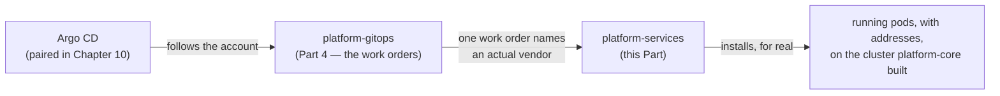
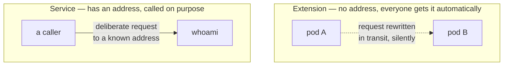

# Chapter 16 — Extensions vs. services

## The account finally gets a real instruction

Chapter 10 paired the smart-home hub to an account: one Argo `Application`
object, nothing but a repository URL and a path, pointing at
`platform-gitops`. Part 4, right before this one, opens that account up
and looks at what's actually filed inside it. This Part is about what
happens once the hub follows one of those instructions all the way to the
end.

Picture the account as a running list of work orders, and `platform-core`
and `platform-gitops` as the two repos that got the account itself set up
and organized. `platform-services` is the first vendor actually named on
that list who shows up and does something with real, running
consequences — not another pointer to follow, an install. Everything from
here on is something you can `kubectl get` and watch respond to a real
request.



## Same base-plus-overlay shape, now with real consequences

`platform-core` gave each environment its own whole cluster. Part 4
covers the other meaning of "environment" this book has been holding off
on — a folder. This repo uses that folder shape too, but for something
with a running, observable result instead of infrastructure underneath
everything else:

```console
$ ls environments/
app-dev  app-prod  base  platform-sandbox
```

`base/` holds what's identical across every environment — which chart,
which vendor to order it from. Each environment's own folder holds only
what has to differ, usually just a version number. Bumping a version
means editing one environment's folder, watching it work, then copying
the same edit into the next one — never touching `base/` for a routine
change. You'll watch this pattern in action for real in the next chapter.

## Two different kinds of vendor work

Not everything this repo installs behaves the same way once it's running,
and the difference is worth having names for before looking at either one
up close.

An **extension** changes how the cluster's own systems behave, for every
pod, automatically — without anyone asking for it directly and without
having an address anyone calls. The service mesh this Part spends the
next two chapters installing is almost entirely this kind: it rewrites
how pods talk to each other, transparently, the moment they exist.
Nobody sends a request *to* the mesh. It's just there, the way wiring is
just there.

A **service** is the other kind: something that runs continuously and has
an address a caller actually uses on purpose. Chapter 20's hands-on
example — a tiny echo service called `whoami` — is exactly this. Someone
port-forwards to it, sends a request, and gets a response back from one
specific pod.



Both categories end up living in this one repo, but the distinction
matters because they fail differently. A broken extension is often
invisible for a while — pods keep running, nothing crashes, and the first
sign of trouble is something downstream quietly behaving wrong in a way
nobody immediately connects back to the mesh. A broken service is usually
loud and immediate, because someone's actual request just failed and they
notice within seconds. Chapter 17's incident is the extension kind of
failure: everything looked like it had started successfully, and the
actual problem was one layer beneath anything an obvious health check
would catch.

## What the rest of this Part does with that distinction

- Chapter 17 installs the extension — the service mesh itself — and tells
  the real story of a failure that didn't look like a failure at first.
- Chapter 18 covers the rule that's supposed to catch a bad deployment
  automatically, before it ships, and an honest gap in what that rule
  actually gets to see.
- Chapter 19 covers the toil of checking any of this worked, and a test
  that reported success while something real was failing underneath it.
- Chapter 20 puts both categories side by side for real: you'll deploy
  the same tiny service two different ways, confirm both are genuinely
  running, and close the loop Chapter 18 leaves open.

---

**Next:** [Chapter 17 — Installing the mesh](17-installing-the-mesh.md)
