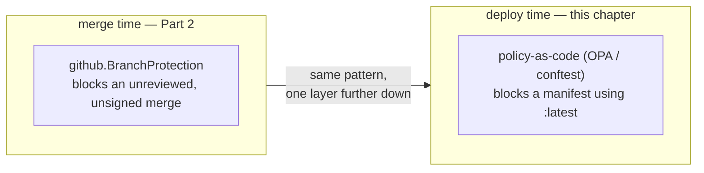

# Chapter 18 — Policy as code

## The forward pointer from Chapter 6, paid off

Chapter 6 named governance at scale — a platform enforcing a rule
uniformly, by machine, once no single person can hold every rule in their
head — and then pointed straight at this Part: the same pattern, one
layer further down the pipeline, applied to what actually gets deployed
instead of how code gets merged. Branch protection governs exactly one
moment: how a change gets into `main`. It has nothing to say about what
that change actually does once it's running. This chapter is that other
moment.



## A rule, written once, checked every time

[`policy/deny-latest-tag.rego`](https://github.com/phrankson/platform-services/blob/main/policy/deny-latest-tag.rego)
is written in Rego, the language a tool called Open Policy Agent (and its
command-line counterpart, `conftest`) uses to evaluate structured files
like Kubernetes manifests:

```rego
deny contains msg if {
	input.kind == "Deployment"
	some i
	endswith(input.spec.template.spec.containers[i].image, ":latest")
	msg := sprintf(
		"Deployment %s uses :latest tag in container %s",
		[input.metadata.name, input.spec.template.spec.containers[i].name],
	)
}
```

Read plainly: if the thing being checked is a Deployment, and any of its
containers uses an image tagged `:latest` instead of a specific version,
produce a message naming exactly which Deployment and which container.
`:latest` isn't a version — it's a moving target that can point to a
different actual image every time it's pulled, which means nobody can say
for certain what's actually running. This rule exists to catch that
before it ships, not after something breaks and nobody can reproduce it.

A second rule,
[`policy/deny-unauthorized-namespace.rego`](https://github.com/phrankson/platform-services/blob/main/policy/deny-unauthorized-namespace.rego),
checks something different: whether a Deployment is even allowed to land
in the namespace it's asking for. Both rules live in the same policy
folder, and a single manifest gets checked against every `deny` rule
across every file there at once — any one of them failing is enough to
reject it.

<details>
<summary><strong>Predict before reading on:</strong> the command below runs this exact policy against this repo's own real, live Istio Deployments, and it passes cleanly. Before reading the result, what would it actually take for that pass to mean "everything here is genuinely compliant," versus something weaker?</summary>

A passing check like this only means what it looks like it means if the
rule actually had a real Deployment in front of it to inspect. If the
input handed to `conftest` never contained a `kind: Deployment` object at
all, the rule has nothing to evaluate, and "0 failures" is really "0
opportunities to fail" — not proof of compliance. Keep that distinction
in mind for the next section, because it's exactly what's happening in
this project's CI pipeline right now.
</details>

**Try it yourself** — first, against a deliberately broken manifest, to
see the rule actually catch something:

```console
$ cat <<'EOF' > /tmp/bad.yaml
apiVersion: apps/v1
kind: Deployment
metadata:
  name: bad-app
  namespace: team-a-sandbox
spec:
  template:
    spec:
      containers:
        - name: web
          image: nginx:latest
EOF

$ conftest test -p policy /tmp/bad.yaml
FAIL - /tmp/bad.yaml - main - Deployment bad-app targets unauthorized namespace: team-a-sandbox
FAIL - /tmp/bad.yaml - main - Deployment bad-app uses :latest tag in container web

2 tests, 0 passed, 0 warnings, 2 failures, 0 exceptions
```

Now against this repo's own real, live Istio Deployments:

```console
$ kubectl --context kind-pe-sandbox get deploy istiod istio-ingress -n istio-system -o yaml > /tmp/real.yaml
$ conftest test -p policy /tmp/real.yaml
2 tests, 2 passed, 0 warnings, 0 failures, 0 exceptions
```

## A rule that's only checking one layer of the truth

It would be easy to read that second result as "the CI pipeline confirms
everything here is compliant." That's not what it actually shows, and
this is the coverage gap the predict box above was pointing at.
[`.circleci/config.yml`](https://github.com/phrankson/platform-services/blob/main/.circleci/config.yml)
runs `conftest` pre-merge against the *Kustomize* build for each
environment — the Argo `Application` wrapper objects covered in Chapter
17, the ones that just say "install this chart, at this version, from
this repo." An `Application` object is never a Deployment. The rule that
guards against `:latest` tags checks `input.kind == "Deployment"`, and
that condition never matches an `Application` — so the check passes for
every environment, every single time, and it isn't catching anything,
because the object it's looking for doesn't exist yet at that stage. The
real Deployments only show up once Argo CD renders the Istio Helm charts
much later, inside the cluster itself — which is exactly why the command
above had to reach into the live cluster by hand to check something
real.

The pipeline's own comment, sitting directly above the policy-check step,
says this plainly rather than letting it hide:

```yaml
# CAVEAT: this only sees the Argo Application wrapper objects
# this repo renders (kind: Application), not the actual Istio
# Deployments inside the Helm charts those Applications point
# at -- our deny rules guard on `input.kind == "Deployment"`,
# which never matches an Application CRD. So today this passes
# because the rules don't apply here, not because the real
# Deployments were checked.
```

A passing policy check can mean two very different things: "checked, and
it's fine," or "checked, and there was nothing here for the rule to
apply to." Confusing the second for the first is how a governance program
ends up with a false sense of coverage. Right now, for this repo's actual
CI pipeline, it's the second one.

This isn't presented here as a settled problem. It's a real, current gap,
named the same way this book named `fs.inotify` limits and missing
observability as real gaps rather than tidying them away. Chapter 20
finally gives this rule something real to check — a Helm-templated
Deployment it can actually inspect, in the same pipeline shape used
everywhere else in this repo — and closes this loop for good.

---

**Next:** [Chapter 19 — Toil and verification](19-toil-and-verification.md)
